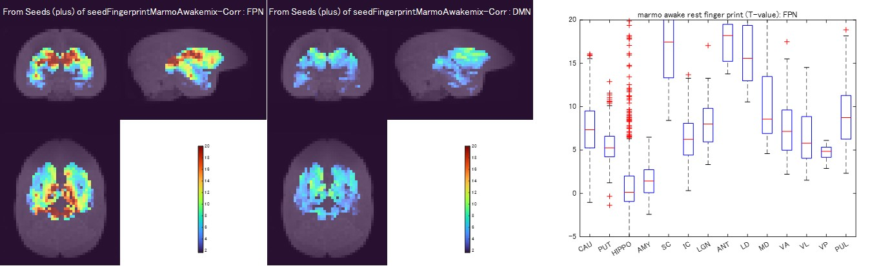

# oku2023dmn
Code for a manuscipt of the default mode network in common marmoset. 
Currently, preprint is available on bioRxiv: 
Takuto Okuno, Noritaka Ichinohe, Alexander Woodward (2023)
["A reappraisal of the default mode and frontoparietal networks in the common marmoset brain"](https://www.biorxiv.org/content/10.1101/2023.11.28.569119v1)

## Requirements: Software
* MATLAB R2019b or later
* Parallel Computing Toolbox ver7.1 or later
* [VARDNN Toolbox](https://github.com/takuto-okuno-riken/vardnn)

Please download the [VARDNN Toolbox](https://github.com/takuto-okuno-riken/vardnn) and "Add Path" in the MATLAB before using this code.

## Installation
1. Download this code and [VARDNN Toolbox](https://github.com/takuto-okuno-riken/vardnn) zip files.
2. Extract zip files under your working directory <work_path>.
3. Run the MATLAB software, and "Add Path" extracted directories (i.e. <work_path>/vardnn-main and <work_path>/oku2023dmn-main).
4. Move to <work_path>/oku2023dmn-main directory and run the following demos.

## Demo Codes
<b>Demo</b> 
The first demo shows the calculation of GLM analysis for auditory task-fMRI data in common marmoset (Fig.2a and b). 
Pre-processed NIfTI files should be downloaded from [zenodo](https://doi.org/10.5281/zenodo.7827225) and extracted under 'data' directory before running this code.
~~~
>> marmoAudGLMindividual
loading : data/s34waM3_1.nii.gz
apply mask atlas...
apply highpass filter (0.0078125 Hz) : tfMRI and design matrix...
process GLM with Tukey-Taper(8) estimation ...
done t=5.3043sec
P-value=0.05, T-value=1.6525
Tmax of GLM6 marmoAuCube1s34waM3_1CTukey8 : audio tmax=9.2829, tcnt=8111, mrv=1.6545
...
~~~

After calculation of GLM analysis for individual sessions, mixed-effects model (2nd analysis) could be applied (Fig.2c).
~~~
>> marmoAudGLMmixed
process GLM with Tukey-Taper(8) estimation ...
done t=0.5378sec
P-value=0.001, T-value=4.1437
Tmax of GLM6marmoAudD 2nd-mix-Tukey8full : audio tmax=50.7377, tcnt=1759, mrv=0.0036622
~~~

This demo shows fingerprint analysis of awake marmoset.
T-values of sub-cortical voxels of correlating with DMN time-series and FPN time-series are shown (Fig.4a and b top).
~~~
>> marmoAwakeFingerprint
process Mixed-Effects correlation ...
process seed analysis of correlation ...
process session(1) t=0.014393
...
P-value=0.05, T-value=1.6779
Tmax (source) of seedFingerprintMarmoAwakemix-Corr : FPN tmax=26.9124, tcnt=746, mrv=NaN
Tmax (source) of seedFingerprintMarmoAwakemix-Corr : DMN tmax=11.1839, tcnt=585, mrv=NaN
~~~

